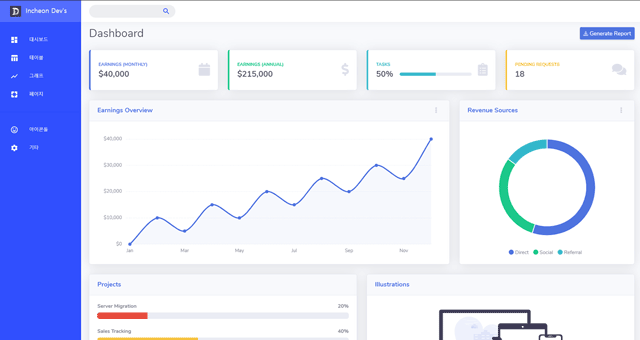

<h1 align="center"> [React.js-MaterialUI] iDevs Admin Template</h1>
<p>
  
</p>

### 소개

안녕하세요. 👋 인천 지역 개발자 모임인 Incheon Dev's에서 만드는 React.js와 Material UI를 활용한 관리자 템플릿 프로젝트입니다. (아직 진행중인 프로젝트입니다.)

### 미리보기



### 사용한 라이브러리

Library | Spec.
--- | ---
[React.js](https://reactjs.org/) [[한국어](https://ko.reactjs.org/)] | 16.8.6+
[Material-UI](https://material-ui.com/) | 4.1.3+
[React Router](https://reacttraining.com/react-router/web) | 5.0.1+

### 테스트 방법

> node.js(npm)이 설치되어 있어야 합니다.

- 최초 클론(혹은 다운로드)시 프로젝트 개발 환경 관련 및 라이브러리 모듈들을 설치해야니다.

```sh
$ npm install
[or]
$ yarn
```

- 테스트 모드로 실행합니다.

```sh
$ npm run start
[or]
$ yarn start
```

### 참여 가이드

- 저희 프로젝트는 git-flow와 github-pull-request를 사용하여 누구에게나 프로젝트 참여의 가능성을 열어두고 있습니다.
- 자세한 방법은 [Wiki-Participation Guide](https://github.com/incheonjs/react-idevs-materialui-admin-one/wiki/Participation-Guide)를 참고해 주세요.

### Contact us

🏠 [Incheon Dev&#39;s Website](https://incheon.devs.co.kr)
💬 [Incheon Dev&#39;s 카톡채팅방](https://open.kakao.com/o/gHsHtdpb)
